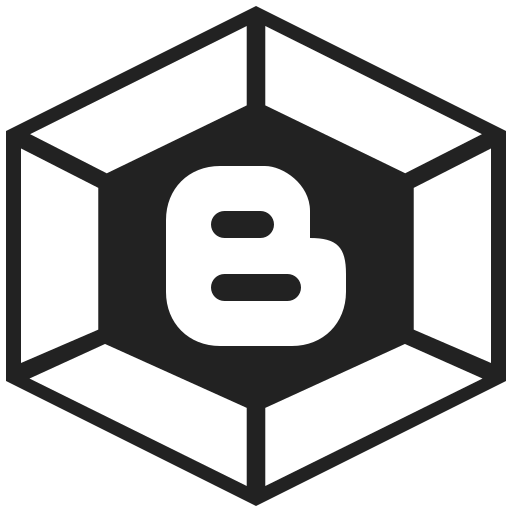

<p align="center">
  <a href="https://github.com/bloggerpack/blogger-snippets">Blogger snippets</a>
  ·
  <a href="https://github.com/bloggerpack/plugins">Plugins</a>
</p>

---

<p align="center">
  
</p>

<h3 align="center">Bloggerpack</h3>

<p align="center">
  A tool for develop Blogger theme.
  <br>
  <br>
  <a href="#getting-started">Getting started</a>
  ·
  <a href="#concepts">Concepts</a>
  ·
  <a href="#changelog">Changelog</a>
  ·
  <a href="#license">License</a>
</p>

---

<h3 align="center">Getting started</h3>

<p align="center">
  <a href="#features">Features</a>
  ·
  <a href="#usage">Usage</a>
  ·
  <a href="#folder-structure">Folder structure</a>
</p>

---

## Features

- [Nunjucks](https://mozilla.github.io/nunjucks/)
- Sass and ES6+
- CSS and JS linter
- CSS and JS minification
- and more

## Usage

[Download starter themes](starter)

## Folder structure

```text
.
├── dist/ (g)
|   └── theme.xml <---------------------------+  # compiled <---+
├── src/                                      |                 |
|   ├── dist/ (i)(g)                          |  # source ----->|
|   |   ├── js.js <---------------+           |
|   |   ├── sass.css <------------|---+       |
|   |   └── skin.css <------------|---|---+   |
|   ├── js/                       │   |   |   |
|   |   ├── js-in-template.js (g) |   |   |   |
|   |   └── index.js ------------>|   |   |   |
|   ├── sass/                         |   |   |
|   |   ├── _sass-in-template.scss (g)|   |   |
|   |   └── index.scss -------------->|   |   |
|   ├── skin/                             |   |
|   |   ├── skin-in-template.css (g)      |   |
|   |   └── index.css ------------------->|   |  # (i) = Must be included in template (see `` tag)
|   ├── template/ (n)                         |  # (n) = Not specify or can be renamed or moved
|   ├── index.njk --------------------------->|  # (g) = Auto-generated
|   └── layout.njk (n)
├── .browserslistrc
├── .eslintrc.json
├── .stylelintrc
├── banner.txt
├── data.json
└── package.json
```

---

<h3 align="center">Concepts</h3>

<p align="center">
  <a href="#config-files">Config files</a>
  ·
  <a href="#template">Template</a>
  ·
  <a href="#sass">Sass</a>
  ·
  <a href="#skin">Skin</a>
  ·
  <a href="#js">JS</a>
</p>

---

## Config files

### `.browserslistrc`

The config to share target browsers. Learn more about [Browserslist](https://github.com/browserslist/browserslist).

### `.eslintrc.json`

The default config is recommended, but if you want to change the config you can read the [ESLint docs](https://eslint.org/docs/user-guide/configuring).

### `.stylelintrc`

The default config is recommended, but if you want to change the config you can read the [Stylelint docs](https://stylelint.io/user-guide/configure).

### `banner.txt`

The header for compiled Sass, Skin and JS. You can access data from `data.json` using `<%= data.keyName %>`.

### `data.json`

Store your theme config in this file. This is Nunjucks template context, which means it can be accessed in [template files](#template) using `{{ data.keyName }}`. You can also access data from `package.json` using `{{ pkg.keyName }}`. See [Nunjucks variables](https://mozilla.github.io/nunjucks/templating.html#variables).

Example:

```text
/*!
 * <%= data.theme.name %> v<%= data.theme.version %>
 */
```

### `package.json`

Use this file to manage and install Bloggerpack and other packages. You also will need to add Bloggerpack commands and tasks.

## Template

We uses [Nunjucks](https://mozilla.github.io/nunjucks/templating.html) for its template engine. File extension for template files is `.njk`.

### Template tag

Wrap the markup with `<template to='bp-template'>`-`</template>` tag in `.njk` files.

```njk
<template to='bp-template'>
  <p>example</p>
</template>
```

### Including template

Do not use the default Nunjucks `` tag, use `` tag instead.

Note: the path is relative to the `index.njk` root directory.

src/example-dir/file1.njk:

```njk
<template to='bp-template'>
  <p>example</p>
</template>
```

src/example-dir/file2.njk:

```njk
<template to='bp-template'>
  <div>
    
  </div>
</template>
```

src/index.njk:

```njk
<template to='bp-template'>
  
</template>
```

Output (`dist/theme.xml`):

```html
<div>
  <p>example</p>
</div>
```

### Including template from node modules

You can also include template from node modules:

```njk
<template to='bp-template'>
  
</template>
```

Below is example of `package-name/path/to/file.njk`:

```njk
<template to='bp-template'>
  Template here
</template>

<style to='bp-sass'>
CSS for the template here
</style>

<style to='bp-skin'>
Skin for the template here
</style>

<script to='bp-js'>
JS for the template here
</script>
```

[Sass](#sass-in-template), [Skin](#skin-in-template), and [JS](#js-in-template) are optional.

**Plugin package name:**

Plugin package names must start with `bloggerpack-plugin-*` to automatically extract the Sass, Skin, and JS in template.

### Including assets

Use this tag to include compiled [Sass](#sass), [Skin](#skin), [JS](#js), and other CSS and JS assets:

```njk

```

Example:

```njk
<template to='bp-template'>
  <head>
    {# Auto style tag #}
    

    {# Auto skin tag #}
    
  </head>
  <body>
    ...

    {# Auto script tag #}
    
  </body>
</template>
```

Custom `tag_start` and `tag_end`:

```njk



```

Block tag:

```njk

  <b:if cond='!data:view.isLayoutMode'>
  <style>
  .element {
    display: block;
  }
  </style>
  </b:if>



  <script>
  //<![CDATA[
  console.log('Hello');
  //]]>
  </script>

```

Block tag with files:

Use `{? asset ?}` tag.

```njk

  <b:if cond='!data:view.isLayoutMode'>
  <style>
  {? asset "path/to/file1.css" ?}
  {? asset "path/to/file2.css" ?}
  </style>
  </b:if>



  <script>
  //<![CDATA[
  {? asset "path/to/file1.js" ?}
  {? asset "path/to/file2.js" ?}
  //]]>
  </script>

```

### Extending template

Use Nunjucks `` tag. See [Nunjucks template inheritance](https://mozilla.github.io/nunjucks/templating.html#template-inheritance).

src/layout.njk:

```njk
<template to='bp-template'>
  <header>
    
  </header>

  <main>
    
  </main>

  <footer>
    
  </footer>
</template>
```

src/index.njk:

```njk
<template to='bp-template'>
  

  
  This is header content.
  

  
  This is main content.
  

  
  This is footer content.
  
</template>
```

### Template example

[See example](test/tasks/template).

## Sass

Write your styles with [Sass](https://sass-lang.com/). You can also import Sass package from node modules.

### Partialize

Do not write styles in `src/sass/index.scss` directly. Add a new file (e.g., `_my-component.scss`) within `src/sass/` and than import the file to `src/sass/index.scss`.

```scss
@import "my-component";
```

### Sass-in-Template

You can write CSS for specific template in the template file directly using `<style to='bp-sass'>` tag.

```njk
<template to='bp-template'>
  <h1 class='example'>Example</h1>
</template>

<style to='bp-sass'>
$heading-color: #fff !default;

.example {
  color: $heading-color;
}
</style>
```

The styles within the tag would be automatically extracted to `src/sass/_sass-in-template.scss`.

### Sass example

[See example](test/tasks/sass).

### Remove Sass

If you don't need to use the Sass feature, you can remove the `src/sass` folder.

## Skin

Skin is CSS that support Blogger's skin variables to allow your theme to be able to customize through the Blogger theme designer.

### Partialize

Do not write styles in `src/skin/index.css` directly. Add a new file (e.g., `my-component.css`) within `src/skin/` and than import the file to `src/skin/index.css`.

```css
@import "my-component";
```

### Skin-in-Template

You can write skin CSS for specific template in the template file directly using `<style to='bp-skin'>` tag.

```njk
<template to='bp-template'>
  <h1 class='example'>Example</h1>
</template>

<style to='bp-skin'>
/*
<Variable name="heading.color"
    description="Heading color"
    type="color"
    default="#ffffff"
    value="#ffffff"/>
*/

.example {
  color: $(heading.color);
}
</style>
```

The styles within the tag would be automatically extracted to `src/skin/skin-in-template.css`.

### Skin example

[See example](test/tasks/skin).

### Remove Skin

If you don't need to use the Skin feature, you can remove the `src/skin` folder.

## JS

The JavaScript. You can write your script with ES6+ and you can also import package from node modules.

### Partialize

Do not write scripts in `src/js/index.js` directly. Add a new file (e.g., `util.js`) within `src/js/` and than import the file to `src/js/index.js`.

```js
import './util';
```

### JS-in-Template

You can write JavaScript for specific template in the template file directly using `<script to='bp-js'>` tag.

```njk
<template to='bp-template'>
  <h1 class='example' id='example'>Example</h1>
</template>

<script to='bp-js'>
var example = document.getElementById('example');
</script>
```

The JavaScript within the tag would be automatically extracted to `src/js/js-in-template.js`.

### JS example

[See example](test/tasks/js).

### Remove JS

If you don't need to use the JS feature, you can remove the `src/js` folder.

---

## Changelog

See [CHANGELOG](https://github.com/bloggerpack/bloggerpack/blob/master/CHANGELOG.md).

## License

Licensed under [MIT](https://github.com/bloggerpack/bloggerpack/blob/master/LICENSE).
